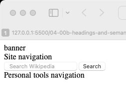

# Wikipedia main page Rotor's Landmarks

To get the Rotor's Landmark dialogue for Wikipedia main page do this:

1. Turn on VoiceOver: `Command-F5`
2. In safari, navigate to [en.wikipedia.org/wiki/Main_Page](https://en.wikipedia.org/wiki/Main_Page)
3. Press: `VO-U` to activate Rotor.
4. Press: `LeftArrow` or `RightArrow` several time until you see the **Landmarks** menu:


This Landmarks are created with following HTML (`<herder>` tag only):

```HTML
  <body>
    <header>
      banner
      <nav aria-label="Site" role="navigation" >
        Site navigation
      </nav>

      <div>
        <div role="search">
          <form action="/w/index.php" id="searchform">
            <input
              type="search"
              name="search"
              placeholder="Search Wikipedia"
              aria-label="Search Wikipedia"
              autocapitalize="sentences"
              title="Search Wikipedia [⌃f]"
              accesskey="f"
              id="searchInput"
              autocomplete="off"
            />
            <input
              id="mw-searchButton"
              type="submit"
              name="fulltext"
              title="Search Wikipedia for this text"
              value="Search" />
          </form>
        </div>

        <nav aria-label="Personal tools" role="navigation" >
          Personal tools navigation
        </nav>
      </div>
    </header>
  </body>
```


This code looks like this in Safari:




The reproduced rotor looks like this:


