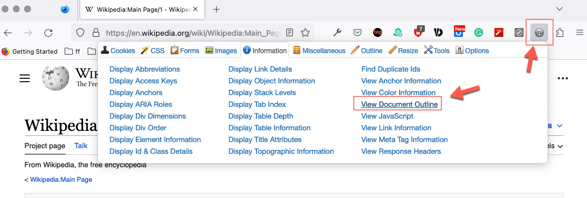
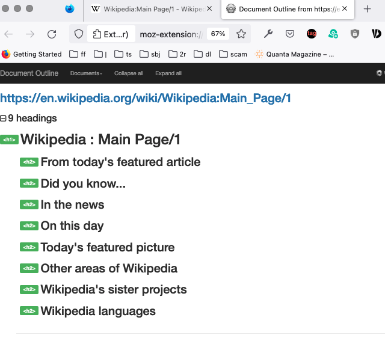
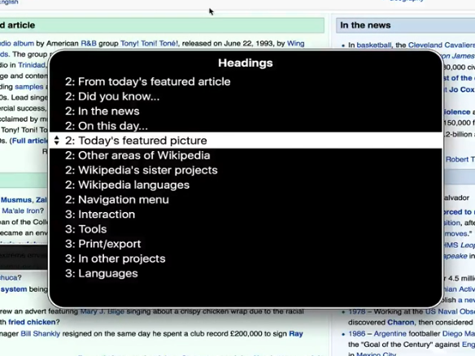

## Heading

Using [Firefox extension: "Web Developer" by chrispederick ](https://addons.mozilla.org/en-CA/firefox/addon/web-developer/) to inspect heading of a [wekipedia main page](https://en.wikipedia.org/wiki/Wikipedia:Main_Page/1):






## About the H1

Key to remember:

- Every page should have an h1
- There should be only one h1


## Cycle through the headings in Safari

In Safari you can cycle through the headings with: 

```
Control-option-command + h
```

Try this:

1. turn on VoiceOver: `Command-F5`
2. in safari, navigate to [en.wikipedia.org/wiki/Main_Page](https://en.wikipedia.org/wiki/Main_Page)
3. press: `control-option-shift + downArrow` to enter the web area.
4. press: `Control-option-command + h` to cycle through the headings.


## Using [Rotor](https://support.apple.com/en-ca/guide/voiceover/mchlp2719/mac) to list Headings

Try this:

1. Turn on VoiceOver: `Command-F5`
2. In safari, navigate to [en.wikipedia.org/wiki/Main_Page](https://en.wikipedia.org/wiki/Main_Page)
3. Press: `VO-U` to activate Rotor.
4. Press: `LeftArrow` or `RightArrow` several time until you see the Headings menu:


